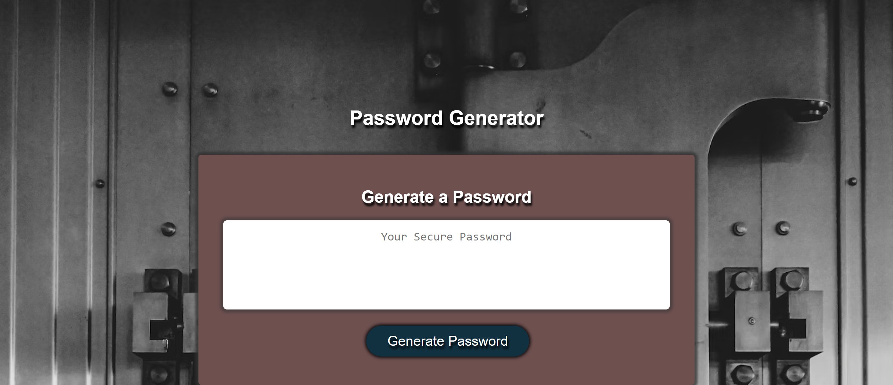
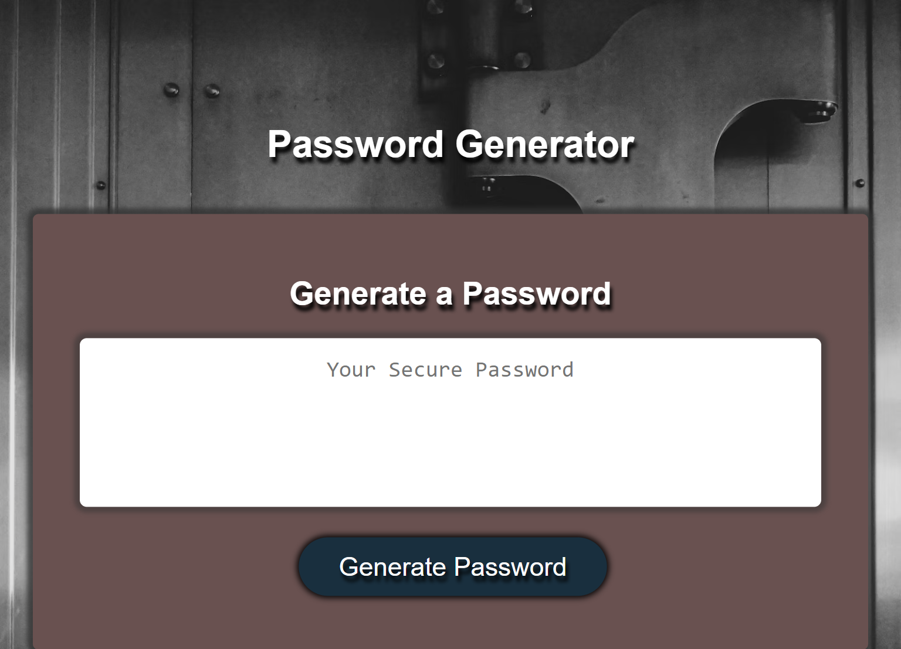
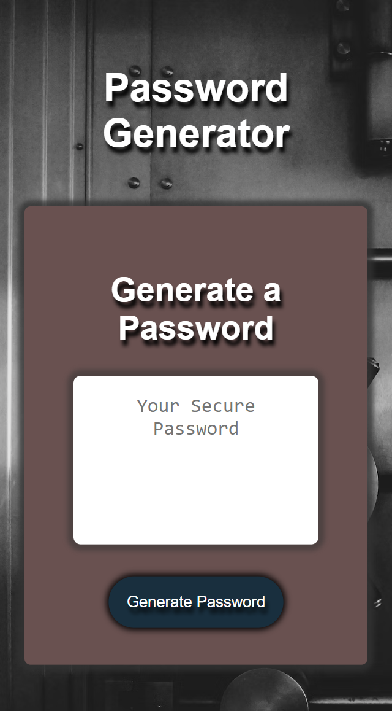

# Random Password Generator

## Overview
I created this random password generator as a way to expand my knowledge of javascript. This project features variables, strings, for loops, while loops, if else statements, functions, event listeners, and query selectors.

## Features

1. Responsive Design

   * I designed my webpage to be fully responsive from the smallest mobile devices, to tablets, to the largest desktops to provide a consistent means to view this project in an enjoyable and engaging experience.

2. Password generator

    * The main purpose of this project is to provide a randomly generated password to provide increased security for the end user's account(s) with user selected password criteria.

3. Technologies Used

    * HTML5
    * CSS
    * JavaScript
    * VSCode
    * GitBash

## Usage
To view this webpage, please visit https://joshmassa.github.io/random-password-generator

To view this projects repository, please visit https://github.com/JoshMassa/random-password-generator

When viewed from a desktop, the webpage should resemble the following image:

When viewed from a tablet, the webpage should resemble the following image:

When viewed from a mobile device, the webpage should resemble the following image:

## Credits

This project brought to you in part by UCLA Extension and it's staff including but not limited to: Our class instructor and teaching assistant of UCLA Extension Coding Bootcamp 2023-2024.

Links to resource references used as follows:

https://developer.mozilla.org/en-US/docs/Web/JavaScript/Reference/Global_Objects/String#instance_methods

https://developer.mozilla.org/en-US/docs/Web/JavaScript/Reference/Global_Objects/Array

## License
This project does not contain a license.